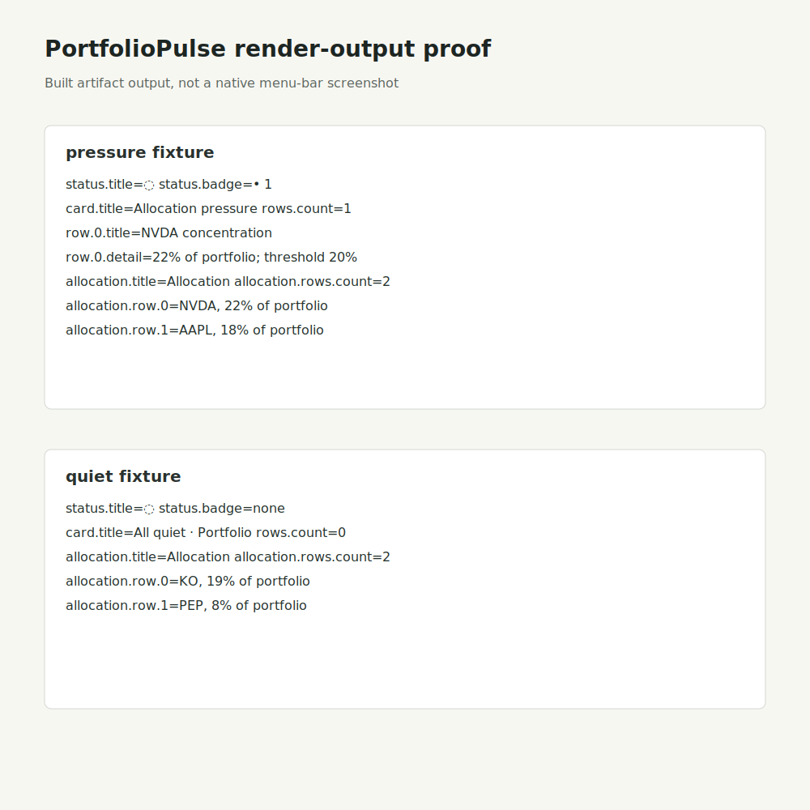

# Issue 5 Proof

This proof covers Allocation engine `Model` rendering through Pulse. Native menu-bar screenshot/video capture is blocked in this worker by macOS TCC unless Bram grants Screen Recording and Accessibility permissions, so the linked image is deterministic render-output proof from the built candidate, not a native screenshot.

## Render Output

## Gates

- PASS: `swift run PulseFixtureChecks`
- PASS: `swift run AllocationFacetChecks`
- PASS: `swift run PDTContractChecks`
- PASS: `swift run PortfolioPulse --fixture pressure --render-once`
- PASS: `swift run PortfolioPulse --fixture quiet --render-once`
- PASS: `swift test`
- PASS: `swift build`
- PASS: `qlmanage -t -s 1200 -o /private/tmp docs/proof/issue-5-render-proof.svg`
- PASS: visual inspection of `/private/tmp/issue-5-render-proof.svg.png`; no clipping or wrapping issues seen.
- PASS: `autoreview --mode local` clean.

## Public Artifact Confidentiality Gate

- PASS: Proof artifacts use deterministic fixture holdings only.
- PASS: No private data, credentials, desktop content, model/provider identifiers, or fake native screenshots.
